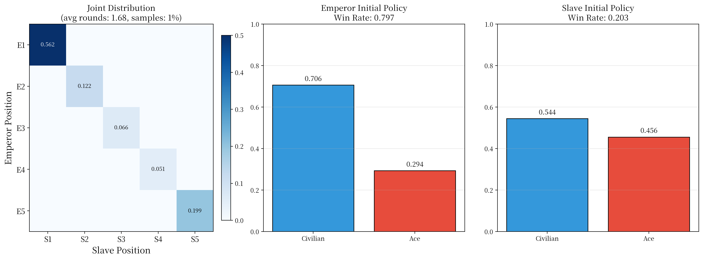

# 《赌博默示录》E卡博弈强化学习实验

## 📖 项目概述

本项目使用 **PPO（Proximal Policy Optimization）** 算法对《赌博默示录》中的经典博弈"E卡（皇帝牌）"进行强化学习研究，旨在探索**非对称奖励结构**对智能体策略演化的影响，并希望一定程度上模拟赌徒在这个游戏上的心理。

实验在原版规则基础上增加了"对手建模"特征（双方在各轮次的历史出牌概率），使智能体能够感知对手的策略风格。研究目标为**客观揭示该博弈的真实策略平衡点与演化趋势**（而非刻意优化某一方的胜率）：以博弈论（静态混合纳什均衡、逆向归纳）为参照，如实记录策略位置、漂移与收敛状态。

**研究定位**（2026-08-08 确立）：本项目回答的问题是"在 ±5 非对称奖励 + 第 5 轮强制王牌规则下，自博弈 PPO 学到的策略落在哪里、是否收敛、与理论均衡相差多少"，结论基于实验数据而非预设立场。

***

## 🎴 游戏规则（E卡博弈）

E卡博弈是《赌博默示录》中的经典心理战：

* **皇帝方**：1张皇帝牌（E）+ 4张平民牌（C）

* **奴隶方**：1张奴隶牌（S）+ 4张平民牌（C）

* **胜负关系**：皇帝克平民 → 皇帝胜；平民克奴隶 → 皇帝胜；奴隶克皇帝 → 奴隶胜；平民对平民 → 平局

* **出牌机制**：每轮双方同时亮出一张牌，若王牌相遇则立即决出胜负（奴隶胜），否则继续下一轮，直至第5轮强制出王牌

**原版收益矩阵**（皇帝视角）：

|    皇帝\奴隶    | 出王牌 (A) | 出平民 (C) |
| :---------: | :-----: | :-----: |
| **出王牌 (A)** | -5（奴隶胜） | +1（皇帝胜） |
| **出平民 (C)** | +1（皇帝胜） |  0（平局）  |

> 注：非对称奖励设计（皇帝胜 +1，皇帝负 -5）模拟了"赔率不同"的设定，即奴隶获胜时收益是皇帝获胜的5倍。

**奖励配置化**：环境奖励统一读取 `Config` 中的 `reward_emperor_win`（皇帝胜，默认 +1.0）与 `reward_emperor_loss`（皇帝视角的"奴隶胜"，默认 -5.0）；同一结果在奴隶视角为对称相反数（训练中 `slave_reward = -reward`）。修改 `ppo.py` 的 `Config` 即可调整奖励，无需改动环境代码。

***

## 🧠 算法与方法

### 核心算法：PPO（Proximal Policy Optimization）

* 采用 **Actor-Critic** 架构，输出动作概率（随机策略），可学习混合策略。

* 使用 **GAE（Generalized Advantage Estimation）** 计算优势函数，提高样本效率。

* 结合 **重要性采样裁剪** 和 **熵正则化**，确保更新稳定且充分探索。

### 状态空间（17维）

| 维度    | 内容                  |
| :---- | :------------------ |
| 0     | 当前轮次 / 最大轮次         |
| 1     | 皇帝是否已出王牌            |
| 2     | 奴隶是否已出王牌            |
| 3     | 奴隶历史出王牌频率           |
| 4     | 皇帝历史出王牌频率           |
| 5     | 皇帝剩余平民牌数 / 4        |
| 6     | 奴隶剩余平民牌数 / 4        |
| 7–11  | 皇帝在各轮次的历史出牌概率（对手建模） |
| 12–16 | 奴隶在各轮次的历史出牌概率（对手建模） |

### 对手建模机制

在状态中加入双方**在每一轮（第1\~5轮）的历史出牌概率**，使智能体能够感知对手的策略风格，从而做出更有远见的决策。hazard 率估计采用**逐轮动作历史**更新（2026-08-08 修正）：`totals[r]` = 到达第 r 轮且此前未出王牌的局数（含删失），`counts[r]` = 其中恰在第 r 轮出王牌的局数；数据利用率近 100%，语义严格正确。

***

## 📊 实验结果

### 训练配置（当前默认值，与 `Config` 一致）

| 参数           | 值                                                        |
| :----------- | :------------------------------------------------------- |
| 训练回合数        | 6,000,000                                                |
| 学习率          | 1e-4（**余弦退火**至 1e-5，`lr_schedule`/`lr_schedule_type` 控制） |
| 折扣因子 γ       | 0.99                                                     |
| GAE λ        | 0.95                                                     |
| PPO 裁剪 ε     | 0.2                                                      |
| 每次更新轮数       | 4（自博弈中过高会过拟合最近批次导致漂移）                                    |
| 熵正则权重        | 0.05 → **0.005** 退火（`entropy_schedule` 控制，末端抑制随机漂移）      |
| 每批样本数        | 32                                                       |
| 隐藏层维度        | 64                                                       |
| 计算设备         | auto（实测对比 CPU/CUDA 前向耗时后选择，`--device` 可覆盖）               |
| SwanLab 模式   | local（仅本地记录，离线运行，`--swanlab-mode` 可切换）                   |
| 双方 update 顺序 | 随机交替（消除固定先后带来的系统不对称）                                     |

### 最新实验结果（2026-08-08，6,000,000 回合完整训练）

> 运行：`run-20260808_165130-oz34cizf`（16:51 → 20:27，CPU 约 476 回合/秒），包含全部收敛性改进（余弦退火、熵终点 0.005、update 随机化、对手建模修正）。

| 指标                            |                        值                       |
| :---------------------------- | :--------------------------------------------: |
| **皇帝胜率**                      |                   **0.7972**                   |
| **奴隶胜率**                      |                     0.2028                     |
| **皇帝期望收益**（胜率×(+1) + 负率×(−5)） |            **−0.217**（静态均衡近似 +0.143）           |
| **皇帝初始出王牌概率 p**               |                     0.2936                     |
| **奴隶初始出王牌概率 q**               |                     0.4556                     |
| **平均结束回合**（末 100 回合）          |                 2.94（长程中值约 1.7）                |
| **末段漂移**（最后 5% vs 相邻窗口）       | 皇帝 **−0.0003** / 奴隶 **+0.0001** → **双方收敛（稳定）** |
| 第 5 轮强制 A-A 局占比               |            4.0%（241,636 / 6,000,000）           |
| 数值健康（NaN / Inf / 静默跳过）        |           0 / 0 / 仅 batch\_std 偶发 4 次          |
| SwanLab debug.log             |                 1 行（离线化，无云端重试）                 |

##

###

***

## 🖼️ 可视化结果

### 最终策略分布（热力图 + 条形图）



### 训练趋势图（训练结束自动导出到 `swanlog/charts/`）

每次训练结束自动导出 7 张 PNG + 1 CSV + 1 诊断文件（全程离线可生成，与 SwanLab UI 同数据源）：

| 文件                                    | 内容                                           |
| :------------------------------------ | :------------------------------------------- |
| `chart_*_win_rate_avg_rounds.png`     | 胜率曲线 + 平均结束回合                                |
| `chart_*_initial_ace_prob.png`        | 首轮出王牌概率（含静态均衡线 1/7）                          |
| `chart_*_expected_reward.png`         | **皇帝期望收益**（胜率×(+1) + 负率×(−5)，含均衡线 +1/7 与零线）  |
| `chart_*_convergence.png`             | **收敛性面板**（王牌率距均衡偏差 + 策略漂移率）                  |
| `chart_*_loss.png` / `chart_*_kl.png` | 损失与 KL 散度                                    |
| `chart_*_skip_count.png`              | update 静默跳过累计计数                              |
| `metrics_*.csv`                       | 全量指标（每 100 回合，含 `emperor_expected_reward` 列） |
| `diagnosis_*.txt`                     | **客观收敛性诊断**（期望收益 vs 均衡、王牌率偏差、末段漂移判定）         |

## 📁 目录结构说明

```
.
├── README.md                              # 本文件
├── ppo.py                                 # 核心训练代码（PPO + 对手建模）
├── requirements.txt                       # Python 依赖清单
├── .gitignore                             # Git 忽略规则（训练产物不入库）
├── data/
│   ├── ppo_opponent_modeling.png         # 最终结果图（热力图 + 策略分布）
│   └── checkpoints/ppo_checkpoint.pt     # 训练检查点（每 5000 回合）
├── swanlog/
│   ├── run-*/                            # SwanLab 本地实验数据（mode=local 离线记录）
│   │   ├── debug/debug.log               # local 模式仅数行（无云端重试风暴）
│   │   ├── files/config.yaml             # 训练配置存档
│   │   └── media/                        # SwanLab 曲线图（若从云端/本地导出）
│   └── charts/                           # 训练结束自动导出（7 PNG + CSV + 诊断）
│       ├── chart_*_expected_reward.png   # 皇帝期望收益时间序列
│       ├── chart_*_convergence.png       # 收敛性面板（均衡偏差 + 漂移率）
│       ├── metrics_*.csv                 # 全量指标（每 100 回合）
│       └── diagnosis_*.txt               # 客观收敛性诊断
└── PPO_Opponent_Modeling-2026-7-17_10_37_19.txt   # 历史训练日志（终端输出）
```

## 🚀 如何运行

### 1. 安装依赖

```bash
pip install -r requirements.txt
```

### 2. 运行训练

```bash
python ppo.py
```

### 3. 查看Swanlab实验面板

```bash
swanlab watch ./swanlog
```

然后打开浏览器访问 <http://127.0.0.1:8000（local> 模式需要 `pip install 'swanlab[dashboard]'` 提供 swanboard 界面；训练曲线也可直接查看 `swanlog/charts/` 下自动导出的 PNG/CSV）

### 命令行参数

| 参数                                                | 说明                                        |
| :------------------------------------------------ | :---------------------------------------- |
| `--quick`                                         | 运行短时验证（约 1 分钟），通过后退出码为 0                  |
| `--episodes N`                                    | 覆盖训练回合数                                   |
| `--resume`                                        | 从最新检查点恢复训练                                |
| `--checkpoint-interval N`                         | 覆盖检查点保存间隔（回合数，`0` = 关闭）                   |
| `--seed N`                                        | 覆盖随机种子                                    |
| `--no-tracking`                                   | 禁用 SwanLab 追踪                             |
| `--swanlab-mode online\|local\|offline\|disabled` | SwanLab 运行模式（默认 `local` 离线：仅本地记录，无云端连接重试） |
| `--no-charts`                                     | 禁用训练结束后的曲线自动导出（默认导出到 `swanlog/charts/`）   |
| `--device auto\|cpu\|cuda`                        | 计算设备（默认 `auto`：实测对比 CPU/CUDA 前向耗时后选择）     |

***

## 💾 检查点（保存 / 恢复）

训练循环每 `checkpoint_interval`（默认 5000）回合自动保存一次检查点，文件位于 `data/checkpoints/ppo_checkpoint.pt`。检查点包含：

* 完整配置（`Config` 全字段，含奖励配置）与回合标识（`episode`）

* 双方网络权重与优化器状态

* 全局统计（对手建模轮次概率、联合分布计数、胜负计数、回合长度列表）

* 三个随机数生成器状态（torch / numpy / python），保证恢复后训练轨迹与未中断运行一致

**恢复训练：**

```bash
python ppo.py --resume
```

从检查点记录的回合继续训练至 `episodes` 目标，无需人工修改任何参数。

**通过判据（检查点一致性验证）：** 在相同种子下，路径 A（连续训练 N 回合）与路径 B（先训练 N/2 回合并保存，再 `--resume` 继续至 N 回合）的最终胜率、策略概率、平均回合误差 < 1e-6，即视为保存/加载无损。

***

## ✅ 短时验证（--quick）

```bash
python ppo.py --quick
```

固定种子（默认 42）、禁用 SwanLab、约 300 回合，覆盖四类检查项：

| 检查项     | 通过判据                                                                                   |
| :------ | :------------------------------------------------------------------------------------- |
| 奖励符号    | 奴隶胜奖励 == `Config.reward_emperor_loss`（负）；皇帝胜 == `Config.reward_emperor_win`（正）；平局 == 0 |
| 环境步进    | reset 状态维度 == 17；A-A/E-C/C-E 立即终止且 result 正确；第 5 轮强制 A-A → slave\_win；步进后状态数值有限        |
| 网络前向    | actor 输出形状 (1, 2)、critic 输出形状 (1, 1)、数值有限                                              |
| 短循环收敛方向 | 300 回合内 actor loss 采样点全部有限且后段均值 < 前段均值（下降）；胜率 ∈ \[0,1]；平均回合有限                          |
| 跳过计数器   | 静默跳过计数（标准差过小 / 非有限概率 / 非有限损失）存在且非负，训练日志中可见                                             |

所有检查项 PASS 时输出 `短时验证结果: 全部通过` 并以退出码 0 结束，任一 FAIL 则退出码为 1。
